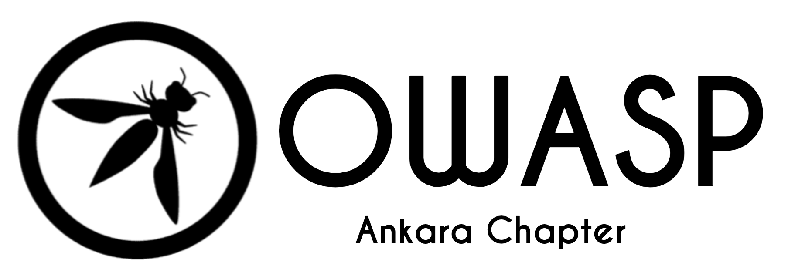

---

layout: col-sidebar
title: OWASP Ankara
tags: example-tag
level: 4
type: example
altfooter: true
meetup-group: owasp-ankara
country: 
postal-code: 

---

<!-- rebuild 14 -->
# OWASP Ankara
----
Welcome to the Ankara chapter homepage. The chapter board is <a href="mailto:alper.basaran@owasp.org">Alper Basaran</a>.

Follow chapter news on [Twitter](https://twitter.com/owaspankara)

:+1:

### :calendar: Check our Upcoming Meetup Events: 
----

## OWASP Ankara ile TRYHACKME OWASP Top 10 Eğitimi

TryHackMe sızma testleri konusunda kendini geliştirmek isteyenlere ücretsiz birçok imkân sunmaktadır. Bunların arasında OWASP tarafından belirlenen Top 10 web uygulama güvenlik açıklarını da kapsayan OWASP Top 10 odası bulunmaktadır. 
Ücretsiz bir TryHackMe hesabı açarak bu ücretsiz eğitime katılarak en tehlikeli 9 web uygulaması güvenlik açığı ve log analizi konusunda uygulamalar yaparak tecrübe kazanabilirsiniz. 

### Eğitim içeriği

Eğitim sırasında aşağıdaki konular önce konu anlatımı sonra uygulamalarla ele alınacaktır;
1.	Web uygulamaları sızma testlerinde kullanılan araçlar
2.	Web uygulama test metodolojisi
3.	Web uygulama güvenlik risk değerlendirme ölçeği
4.	Injection
5.	Kimlik doğrulama hataları
6.	Hassas veri ifşası
7.	XML External Entities (XXE)
8.	Erişim denetimi hataları
9.	Güvenlik ayarlarında hata
10.	Sitelerarası betik çalıştırma (XSS)
11.	Güvensiz deserialization
12.	Bilinen güvenlik açıklarına sahip bileşenlerin kullanılması
13.	Yetersiz loglama ve izleme

Eğitim formatı
Her konu önce nedenleri, istismar senaryoları ve risklerle ilgili teorik ele alınacak ve ardından TryHackMe ortamında uygulamalı olarak gösterilecektir. 
Katılımcıların ücretsiz bir TryHackMe üyeliği açmaları ve kendi ortamlarına Kali Linux kurmaları gerekmektedir. TryHackMe ortamına OpenVPN üzerinden bağlanılmaktadır, eğitim öncesi katılımcıların bu bağlantıyı test etmelerinde fayda olacaktır. 
Eğitim sırasında eğitim içeriyle ilgili sorular yanıtlanacak ancak Kali kurulumu ve OpenVPN konusunda destek verilmeyecektir. 

* Eğitim tarihi: 5 Aralık 2020
* Eğitim saati: 14:00 – 17:00 
* Eğitim yeri: Eğitim Zoom üzerinden yapılacaktır
* Katılım kontenjanı: 90 kişi
* Eğitim bedeli: Eğitim ücretsizdir 
* **Kayıt için [Tıklayın !](https://forms.gle/SLQe6RniS5AAtJWy8)**

